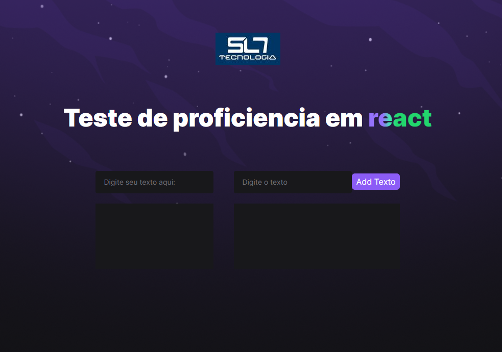

<div align="center" id="top"> 
  

  &#xa0;

  <!-- <a href="https://web.netlify.app">Demo</a> -->
</div>

<h1 align="center">SL7 Tecnologia - Teste de Proeficiencia React</h1>



<!-- Status -->

<!-- <h4 align="center"> 
	🚧  Web 🚀 Under construction...  🚧
</h4> 

<hr> -->

<p align="center">
  <a href="#dart-about">About</a> &#xa0; | &#xa0; 
  <a href="#rocket-technologies">Technologies</a> &#xa0; | &#xa0;
  <a href="#white_check_mark-requirements">Requirements</a> &#xa0; | &#xa0;
  <a href="#checkered_flag-starting">Starting</a> &#xa0; | &#xa0;
  <a href="https://github.com/Winnicius-Moura" target="_blank">Author</a>
</p>

<br>

## :dart: About ##

Projeto para teste de proeficiencia em React pela empresa SL7 Tecnologia

#Algumas melhorias
<li>Responsividade</li>
<li>Utilização de TailwindCSS</li>


## :rocket: Technologies ##

The following tools were used in this project:

- [Node.js](https://nodejs.org/en/)
- [React](https://pt-br.reactjs.org/)
- [TypeScript](https://www.typescriptlang.org/)
- [TailwindCSS](https://tailwindcss.com/)
- [ViteJS](https://vitejs.dev/)

##VEJA O PROJETO FUNCIONANDO
<a href="https://sl7-react-winnicius-moura.vercel.app/" target="_blank">Clique aqui</a>

## :white_check_mark: Requirements ##

Before starting :checkered_flag:, you need to have [Git](https://git-scm.com) and [Node](https://nodejs.org/en/) installed.

## :checkered_flag: Starting ##

```bash
# Clone this project
$ git clone https://github.com/Winnicius-Moura/sl7-react

# Access
$ cd sl7-react

# Install dependencies
$ npm install

# Run the project
$ npm run dev

# The server will initialize in the <http://127.0.0.1:5173/>
```

Made with :heart: by <a href="https://github.com/Winnicius-Moura" target="_blank">{{WNN}}</a>

&#xa0;

<a href="#top">Back to top</a>
